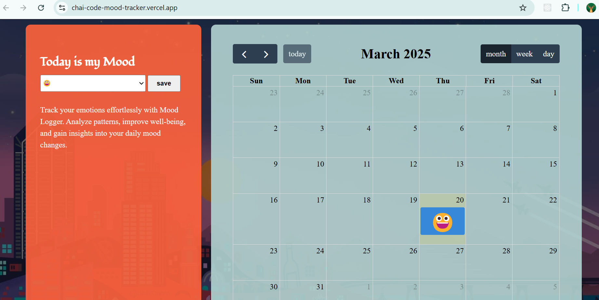

# Daily Mood Tracker

## Overview
A simple web app to log daily moods using emojis and visualize emotional trends over time.

## Features
- 📅 Log daily moods with emojis
- 💾 Save data using LocalStorage
- 📊 View trends in day/week/month formats
- 📆 Calendar view for past moods (for timeline)

## Tech Stack
- HTML, CSS, JavaScript
- LocalStorage for data persistence

## Usage
1. Open the web app.
2. Select an emoji for your mood.
3. View past moods in the timeline or calendar.

Deployement Link
https://chai-code-mood-tracker.vercel.app/
